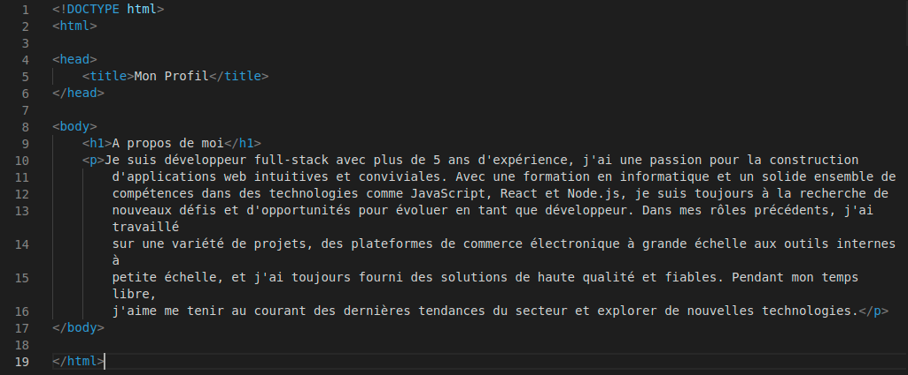

## On s'entraîne !

Maintenant, mettons tout cela ensemble et essayons de créer quelque chose de cool et d'amusant !



```
<!DOCTYPE html>
<html>

<head>
    <title>Mon site CSS simple</title>
    <style>
        body {
            font-family: sans-serif;
            color: #333;
            background-color: rgba(255, 196, 113, 0.75);
        }

        h1 {
            font-size: 2em;
            color: #FF5F6D;
            text-align: center;
            margin: 1em 0;
        }

        p {
            font-size: 1.5em;
            line-height: 1.5;
            margin: 1em 0;
            color: #2C3E50;
        }

        a {
            color: #1ABC9C;
            text-decoration: none;
        }

        a:hover {
            text-decoration: underline;
        }
    </style>
</head>

<body>
    <h1>J'apprends le CSS3</h1>

    <p>Bienvenue sur mon site Web CSS de base, où je vous montre les utilisations de base du CSS et comment il est
        utilisé pour créer des styles et des mises en page cool et amusants pour les pages Web.</p>
    <p>Pour commencer, cliquez ici sur <a href="https://en.wikipedia.org/wiki/CSS">CSS</a> pour lire brièvement sur et
        son utilisation.</p>
    <p>Ensuite, passez à la section <a href="https://en.wikipedia.org/wiki/CSS#Syntax">Syntax</a> de la même page pour
        voir la syntaxe CSS sous ses différentes formes.</p>
    <p>Enfin, visitez la section <a href=" https://en.wikipedia.org/wiki/CSS#Variations">Variations</a> sur la même page
        pour découvrir
        les différentes variantes de CSS et leurs différences.</p>
</body>

</html>
```

[Suivant : Exercez vous ! >>]()