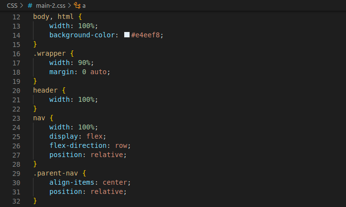

# Bootcamp pour développeurs web

> Niveau: Niveau d'entrée
> Parcours: Semaine 1, jour 2

## Semaine 1 : Introduction au développement Web

## Jour 2 : Concepts et styles de base en CSS

Salut à tous!

Dans cette leçon, nous allons apprendre à connaître quelques concepts fondamentaux et styles de base en CSS. CSS (Cascading Style Sheets) est un langage de feuille de style utilisé pour décrire l'aspect et le formatage d'un document écrit dans un langage de balisage. C'est un langage de portée et il dispose d'une vaste gamme de fonctionnalités.

### Aperçu du sujet :

- Concepts de base de CSS : Cette section couvre les concepts de base du CSS, notamment ce qu'est le CSS, pourquoi il est utilisé et comment il est utilisé pour styliser et mettre en page les pages Web.

- Styles CSS : Cette section présente les différentes façons d'appliquer des styles CSS aux éléments d'une page Web, notamment à l'aide de styles en ligne, de styles internes et de feuilles de style externes.

- Propriétés CSS courantes : Cette section couvre certaines des propriétés CSS les plus courantes et leur utilisation, telles que les propriétés de police, les propriétés de couleur et les propriétés de modèle de boîte.

- Unités CSS : Cette section explique les différentes unités qui peuvent être utilisées avec les propriétés CSS, telles que les pixels, les ems et les pourcentages.

- Sélecteurs CSS : Cette section présente les différentes façons de sélectionner les éléments d'une page Web auxquels appliquer des styles, notamment à l'aide de sélecteurs d'éléments et de classes.

NB : Cette leçon est subdivisée en plusieurs unités. Nous avons voulu que vous puissiez couvrir et appréhender la leçon par bribes, une étape après l'autre. Nous savons que l'apprentissage du code peut être un peu intimidant. C'est pourquoi nous avons décidé de tout décomposer pour vous.

Amusez-vous bien en le parcourant !

[Commençons !]()